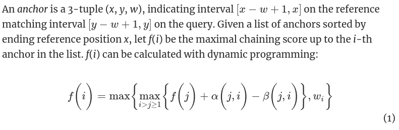

# Gener: 基因变异比对

>  于凡奇 18307130182


**术语约定**

* ref：原串
* sv：变异后的串
* run：sv上读取的子串


## 0 概述

算法主要分为3步：

1. 在 ref 串上确定每个 run 的大致位置；
2. 将每个 run 与 ref 串上的对应位置进行精细比对；
3. 分析第 2 步比对中不匹配的部分，得到变异情况。


**亮点**

- 比对算法中实现了 `minimap2` 的核心方法
- 将核心比对算法进行了较好的封装，在本项目流程中多次调用
- 对 `DUP` 变异的检测较为准确
- 整套流程均为自主实现，未使用 C++ 标准库以外的包，已在 Github (https://github.com/TwistsOfFate/gener) 开源


## 1 在 ref 上大致确定 run 的位置

- 对整个 ref 串中长度为 12 的种子建立哈希索引。
- 对每个 run，查询其每个长度为 12 的子串在 ref 中出现的位置。
- 通过 `minimap2` 提出的动态规划方法将上述种子进行连接，进而找到 run 在 ref 上大致的对应位置。这一步为达到较快的速度，匹配的准确度大约只有45%左右，即每个 run 中能匹配到长度不到一半的子序列。
  - 状态转移方程如下所示，详情见原论文。

- 这一步的结果形式如下，包括 run 和 ref 中的匹配位置，以及此次匹配的得分。

```
struct align_res_t {
	// id1: ref id， id2: run id
    std::string id1, id2;
    // l1,r1 对应ref匹配区间；l2,r2 对应run匹配区间
    unsigned long long l1, r1, l2, r2;
    // 匹配得分，越高越好，表示匹配质量
    double score;
}
```


## 2 精细比对

- 对每个 run，根据第一步的定位结果，截取 ref 中对应位置的子串 base，其中 base 的长度为 run 的 2 倍，以尽量保证匹配成功。在 run 上依次选取长度为 50 的滑动窗口，尝试与 base 匹配，并保存每个位置的匹配得分。这里的匹配算法和第 1 步中的粗匹配相同，但选取的种子长度为 5 而非 12，因而结果更准确。

- 对于得分特别高或特别低的位置，认为 ref 和 base 有不一致，可以怀疑发生了突变。


## 3 分析变异类型

> 假设正常匹配的得分是 1

**DUP**

```
base:   ----222222----------------------------------------
           |      |\       
           |      |   \       
           |      |     \       
           |      |       \       
run:    ----111111--111111-------------------------------
```

在 base 中得分异常高的位置（平均被匹配到了2次），认为发生了 DUP 突变。


**INS**

```
base:   ----111111-111111--------------------------------
                  |\       
                  |   \       
                  |     \       
                  |       \       
run:    ----111111--000000--111111-----------------------
```

在 run 中得分异常低的位置，且在 base 中无对应的得分异常低的位置，认为发生了 INS 突变。


**DEL**

```
base:   ----111111--000000--111111-----------------------
                  |      / 
                  |     /     
                  |   /       
                  | /             
run:    ----111111-111111--------------------------------
```

在 base 中得分异常低的位置，且在 run中无对应的得分异常低的位置，认为发生了 DEL 突变。


**INV/TRA**

```
base:   ----111111--000000--111111-----------------------
                  |       | 
                  |       |   
                  |       |   
                  |       |       
run:    ----111111--000000--111111-----------------------
```

在 base 中得分异常低的位置，且在 run中有对应的得分异常低的位置，认为发生了 INV 突变。如果两个不同串上的INV序列长度接近，则认为是 TRA 突变。


## 4 运行说明

使用 C++ 14, CMake 编译。每个 DNA 序列的处理大约需要 15-20 分钟，最终测试数据约1小时。

运行环境： Ubuntu 20.04, g++ 9.3.0, 内存 32GB